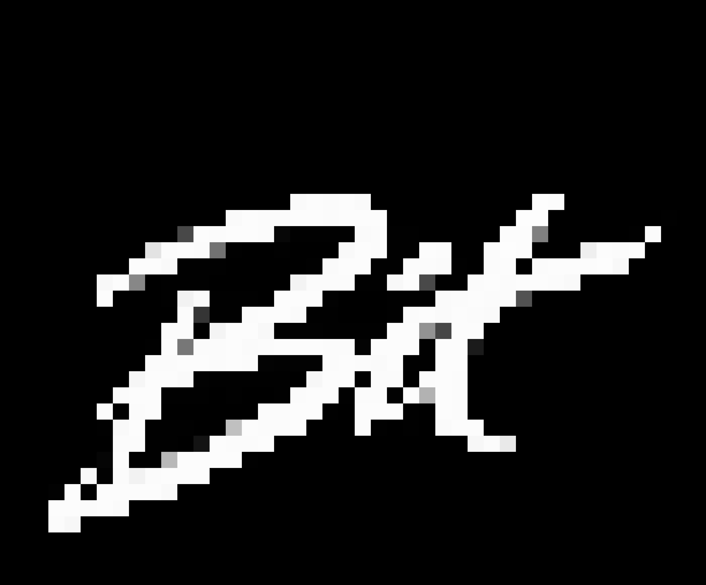

# BIT8_CLI 0.1.0

**English** | [繁體中文](README.zh-TW.md) | [日本語](README.ja.md) | [한국어](README.ko.md)

BIT8_CLI is a small Lua-powered 2D game runtime and development toolkit written in Rust.

Games run on a fixed 64×64 framebuffer, with game logic written in Lua 5.4. BIT8_CLI provides a CLI runtime, tilemaps, sprites and animations, nodes, collision, cameras, a Language Service, and an integrated VS Code development workflow.

## Features

- Lua 5.4 scripting with `.b8`
- Fixed 64×64 framebuffer
- Fixed 30 Hz game simulation
- 8×8 tiles with stable Asset IDs
- Maps up to 256×256 tiles
- Sprite and Animation definitions
- Scriptable Map Nodes
- Solid tiles and Box Colliders
- Camera-based world rendering
- Language Service
- VS Code Map Workspace
- Integrated BIT8 GAME View
- Editor-independent Host Protocol

## Quick Start

### Install from Source

From the repository root:

```bash
cargo install --path . --locked
```

Run a BIT8_CLI project:

```bash
bit8 run <project-path>
```

BIT8_CLI projects normally use `main.b8` as the main script.

Legacy `main.lua` projects remain supported.

### Controls

Default Desktop Runtime controls:

| Key | Action |
| --- | --- |
| Arrow keys | UP / DOWN / LEFT / RIGHT |
| Z | A |
| X | B |
| Escape | Quit |

The project path may be relative to the current directory or an absolute path.

## A Tiny BIT8_CLI Program

```lua
func init()
    x = 28
    y = 28
end

func update()
    if btn(LEFT) then x = x - 1 end
    if btn(RIGHT) then x = x + 1 end
    if btn(UP) then y = y - 1 end
    if btn(DOWN) then y = y + 1 end
end

func draw()
    cls()
    rectfill(x, y, x + 7, y + 7, 7)
end
```

BIT8_CLI uses Lua 5.4 and supports `.b8` scripts. `func` is a BIT8_CLI syntax form that provides a more concise way to define functions.

## Project Structure

A BIT8_CLI project may contain:

```text
my-game/
├── main.b8
├── world.b8map
├── bit8.assets.toml
├── bit8.sprites.toml
├── player.b8
└── tilesheet (A).png
```

Not every project needs all of these files.

`main.b8` assembles the game, while maps, nodes, sprites, and other resources can be added as needed by the project.

## Tilesheets and Asset IDs

BIT8_CLI projects explicitly register PNG tilesheets through `bit8.assets.toml`.

Each PNG dimension must be divisible by 8. Tiles are fixed at 8×8 game pixels, with cells numbered from left to right and top to bottom.

Registered tiles use stable Asset IDs such as:

```text
A1
A2
A3
A4
B1
```

Asset Group identities are assigned explicitly rather than inferred from filenames. This allows `A1` and `B1` to retain their own Group and Cell identities.

Registered tiles can be drawn directly:

```lua
spr(A4, x, y)
```

The lower-level `spr()` / `sprite()` APIs and legacy Numeric Sprites remain supported.

In VS Code, PNG files continue to use the normal Image Preview / Text Editor workflow. BIT8_CLI provides explicit Asset registration rather than taking over general PNG editing behavior.

## Maps

BIT8_CLI stores maps in the text-based `.b8map` format.

For example:

```text
version = 1
width = 4
height = 2

A1 A1 A1 A1
A1 -- A4 A1
```

`--` represents an empty cell. Other cells must use registered Asset IDs.

Maps support dimensions up to **256×256 tiles**.

The Runtime provides:

```lua
map()
mget(x, y)
mset(x, y, tile)
```

`map()` draws the project's `world.b8map`.

`mget(x, y)` reads a map cell using zero-based tile coordinates and returns an Asset ID or `nil`.

`mset(x, y, tile)` changes the map held in the current RuntimeSession. Passing `nil` clears the cell.

Runtime map changes do not rewrite the source `.b8map` file and disappear when the Session ends.

Each tile is 8×8 game pixels, while the framebuffer always remains **64×64 game pixels**.

Therefore:

> **The map is the game world, not the framebuffer.**

The 64×64 framebuffer displays only part of the world at a time.

The BIT8_CLI Map Workspace in VS Code can directly edit `.b8map` files and provides tile selection, Pencil, Eraser, Pan, Zoom, Node, and related editing tools.

## Nodes

BIT8_CLI maps can contain Nodes.

A regular Map Node has a stable ID and can contain a position, Script, Sprite, Collider, and Runtime State.

BIT8_CLI's Node design follows a simple principle:

> **Main assembles the game. Nodes live the game.**

Node Scripts can implement:

```lua
func init()
end

func update()
end

func draw()
end
```

Different Nodes maintain independent Runtime State even when they use the same Script.

A Node can access its own state through `self`, including:

```lua
self.x
self.y
self.id
self.name
self.enabled
```

This allows game objects to keep their behavior in their own Scripts instead of requiring `main.b8` to carry all of the game's logic.

## Sprites and Animation

The BIT8_CLI Sprite workflow is:

```text
PNG
 ↓
Stable Tile ID
 ↓
Sprite / Animation definition
 ↓
Node
 ↓
Script controls Animation
```

Sprite definitions are stored in the optional `bit8.sprites.toml`.

For example, a `Player` Sprite can use `A4` as its Preview and define `idle` and `walk` Animations.

When a Map Node is bound to the `Player` Sprite, the initial Sprite binding occurs before the Node's `init()` runs.

A Node Script can then look like:

```lua
func init()
    self:play("idle")
end

func update()
    if btn(RIGHT) then
        self:move(1, 0)
        self:play("walk")
    else
        self:play("idle")
    end
end

func draw()
    self:spr()
end
```

`self:play()` controls the current Animation.

`self:spr()` draws the Node's current Sprite / Animation Frame.

Each Node has its own Animation playback state, so multiple Nodes using the same Sprite definition still animate independently.

The Map Workspace displays a stable static Sprite Preview rather than the Animation Frame currently playing at Runtime.

## Collision

Registered Map Tiles can be marked as Solid.

Regular Nodes can also have a Box Collider. Its Offset, Width, and Height are expressed in integer game pixels.

Nodes provide:

```lua
self:collide(dx, dy)
self:move(dx, dy)
```

`self:collide(dx, dy)` is a non-mutating collision query and does not change the Node's position.

`self:move(dx, dy)` performs collision-aware movement using a 1-game-pixel sweep, processing X first and then Y.

Directly changing:

```lua
self.x
self.y
```

remains an unrestricted low-level operation.

Collision uses world coordinates and is independent of Camera screen transforms.

## Camera

A Camera Node controls which part of the world is displayed in the 64×64 framebuffer.

The Camera's `x` / `y` coordinates represent the center of the viewport.

If multiple Cameras exist in a Map, the Runtime uses the enabled Camera with the smallest Numeric Node ID.

If there is no valid Camera, the world origin is `(0, 0)`.

World-space content such as Maps, Sprites, and Node Sprites passes through the Camera's world-to-screen transform.

Screen-space drawing APIs remain in screen coordinates.

This allows the Camera to move the view through the game world without changing the actual world coordinates of Maps or Nodes.

## VS Code

The `bit8-vscode` extension provides an integrated development workflow for BIT8_CLI, including:

- BIT8_CLI syntax support
- Completion
- Hover
- Diagnostics
- Map Workspace
- Sprite information
- Node editing
- Asset registration
- BIT8 GAME View
- Run / Stop Commands

The Map Workspace can directly edit `.b8map` documents while preserving VS Code's native Save, Undo / Redo, Revert, and Dirty State behavior.

BIT8 GAME View displays the Runtime's 64×64 framebuffer and sends keyboard input to BIT8_CLI.

An important distinction:

> **VS Code is a frontend / client for BIT8_CLI, not the BIT8_CLI Runtime itself.**

The BIT8_CLI Core Runtime does not depend on VS Code.

## Host Protocol

To build your own Editor, Frontend, or other Tool, BIT8_CLI can be started without opening the native game window:

```bash
bit8 host <project-path>
```

The Host communicates with the Frontend over stdin / stdout using NDJSON.

A Frontend can provide input and receive 64×64 framebuffer Frames while the game simulation remains managed by RuntimeSession.

BIT8_CLI game simulation runs at a fixed **30 Hz**, independently of how frequently the Frontend requests Frames.

The Host Protocol is intentionally independent of VS Code. Other Editors and Tools can therefore integrate with BIT8_CLI without depending on `bit8-vscode`.

See the technical documentation for lower-level Protocol details.

## Architecture

BIT8_CLI separates the Game Runtime from Editor Integration:

```text
       Game Project
            │
            ▼
      RuntimeSession
            │
       ┌────┴────┐
       ▼         ▼
    bit8 run   bit8 host
       │         │
       ▼         ▼
    Desktop    Editors /
    Window     Tooling
```

`bit8 run` provides native desktop execution.

`bit8 host` provides an interface for Editors and other Frontends.

Both use the same BIT8_CLI Runtime instead of implementing separate game logic.

This allows BIT8_CLI to remain Editor-independent while still providing a fully integrated VS Code development experience.

## Documentation

More detailed BIT8_CLI documentation is available in the repository's `docs/` directory.

You can also refer to:

- `CHANGELOG.md` for a summary of 0.1.0 features and version changes
- `BIT8_SPEC.md` for deeper technical specifications
- `docs/` for detailed Runtime, Sprite, Node, and development workflow documentation

The README is intended to provide a quick understanding of BIT8_CLI rather than replace the full technical specification.

## Project Status

Current version:

**BIT8_CLI 0.1.0**

0.1.0 is the first public release of BIT8_CLI.

BIT8_CLI is still in an early stage of development, so future versions may change APIs, file formats, and parts of the development workflow.

The focus of 0.1.0 is to establish a small but complete foundation: Runtime, Lua Scripts, Assets, Maps, Nodes, Sprites, Animation, Collision, Camera, and Editor Integration.

## License

BIT8_CLI is released under the MIT License.

Copyright (c) 2026 AKI
